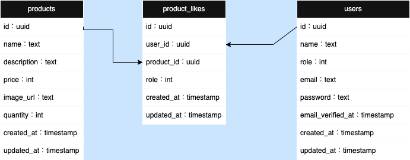

## 目次

- [目次](#目次)
- [本アプリ作成について](#本アプリ作成について)
  - [こだわり・設計思想](#こだわり設計思想)
- [使用技術一覧](#使用技術一覧)
- [プロジェクト名](#プロジェクト名)
- [プロジェクトについて](#プロジェクトについて)
- [環境](#環境)
- [ER図](#er図)
- [ディレクトリ構成](#ディレクトリ構成)
- [環境構築](#環境構築)

## 本アプリ作成について
本アプリはReact,Next.js,Typescriptを用いて開発したecommerceアプリです。学習も兼ねて、ニーズのある通販サイトのテンプレートとして活用できるサービスをイメージして作りました。その他汎用性のある認証機能や一般的なCRUD機能、いいね機能などの実装など幅広く開発ができる余地があるかと思い作成に至りました。

### こだわり・設計思想
- **再利用性・カスタマイズ性**：各機能はコンポーネント単位で切り出しているので、組み込みやすさ・修正のしやすさを意識しています。
- **型安全性**：TypeScript による明確な型定義で、運用や保守のしやすさを向上させました。
- **デザインと操作性**：TailwindCSS による柔軟なスタイリングと、シンプルなUIを心がけました。
- **セキュリティ**：Supabaseによる認証で、セキュリティ面にも配慮しています。
- **技術習得**：新しい技術スタックの知見を深めることも目的としています。

## 使用技術一覧

<!-- シールド一覧 -->
<!-- 該当するプロジェクトの中から任意のものを選ぶ-->
<h2>FW</h2>

  <!-- フロントエンドのフレームワーク,言語一覧 -->
  
  
	
	

<h2>
インフラ
</h2>

  <!-- インフラ一覧 -->

## プロジェクト名
next-ecommerce

## プロジェクトについて
React,Typescript,Next.jsの学習を含めてアプリの作成

## 環境
| 言語・フレームワーク     | バージョン   |
| --------------------- | ---------- |
| React                 | 18.3.1     |
| Next.js               | 13.5.11    |
| tailwindcss           | 3.4.17     |
| typescript            | 5.8.3      |

→npm ls コマンドで確認  
その他のパッケージのバージョンは package.json を参照してください

## ER図

## ディレクトリ構成
<pre> 
.
├── .DS_Store
├── .env.local
├── .eslintrc.json
├── .gitignore
├── .idea
│   ├── .gitignore
│   ├── inspectionProfiles
│   │   └── Project_Default.xml
│   ├── material_theme_project_new.xml
│   ├── modules.xml
│   ├── next-ecommerce.iml
│   ├── vcs.xml
│   └── workspace.xml
├── DB_ER図.drawio.png
├── i18n.js
├── next-env.d.ts
├── next.config.js
├── package-lock.json
├── package.json
├── postcss.config.js
├── public
│   ├── locales
│   │   └── ja
│   │       └── translation.json
│   ├── next.svg
│   └── vercel.svg
├── README.md
├── src
│   ├── app
│   │   ├── api
│   │   │   ├── checkout
│   │   │   └── checkout-session
│   │   ├── auth
│   │   │   ├── signin
│   │   │   └── signup
│   │   ├── cancel
│   │   │   └── page.tsx
│   │   ├── favicon.ico
│   │   ├── globals.css
│   │   ├── layout.tsx
│   │   ├── page.tsx
│   │   ├── pages
│   │   ├── products
│   │   │   ├── [id]
│   │   │   ├── index
│   │   │   └── new
│   │   ├── scripts
│   │   │   └── UpdateRoleApi.ts
│   │   └── success
│   │       └── page.tsx
│   ├── components
│   │   ├── CancelPage.tsx
│   │   ├── CreateProducts.tsx
│   │   ├── FavoriteButton.tsx
│   │   ├── Footer.tsx
│   │   ├── Header.tsx
│   │   ├── Logout.tsx
│   │   ├── next-i18next.config.js
│   │   ├── ProductDetail.tsx
│   │   ├── SignInForm.tsx
│   │   ├── SignUpForm.tsx
│   │   ├── SuccessPage.tsx
│   │   └── UseAuth.tsx
│   ├── middleware.ts
│   └── utils
│       └── supabaseClient.ts
├── tailwind.config.ts
└── tsconfig.json
</pre>

<h3>フォルダ構成確認コマンド</h3>
tree -a -I "node_modules|.next|.git|.pytest_cache|static" -L 2

・-a : 隠しファイル・ディレクトリも表示 
・-I "パターン" : 指定したパターンにマッチするファイル/ディレクトリを除外（正規表現可、|で区切り） 
・L 2 : 階層を2階層までに制限

## 環境構築
1.git clone <リポジトリURL>  
2.cd next.js-ecommerce  
3.npm install  
4.npm run dev

